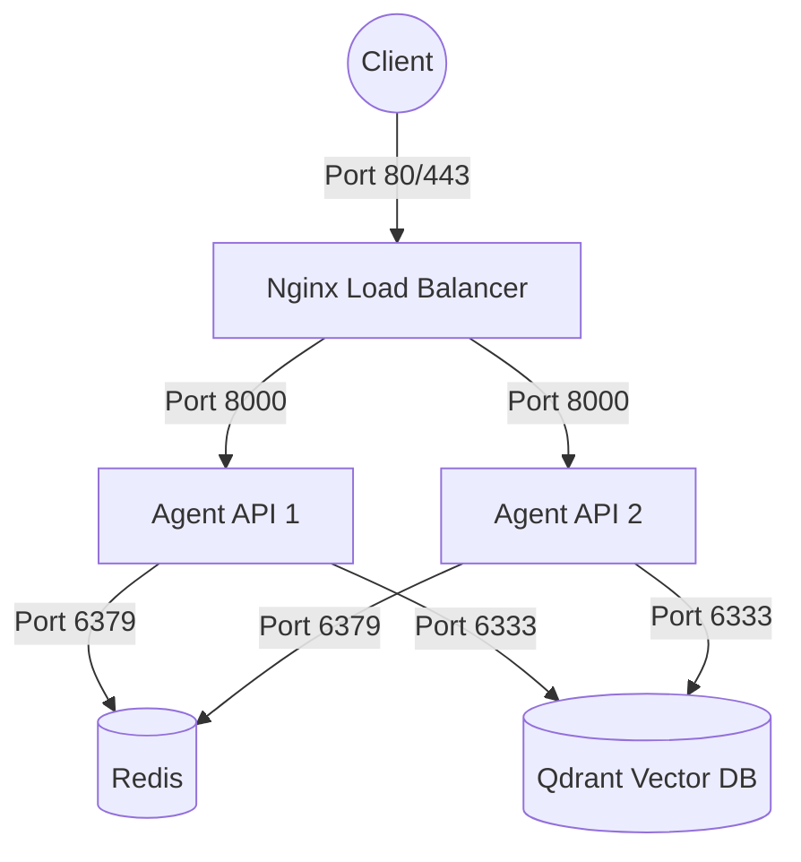

# Day 12 Lab - Mission Answers

## Part 1: Localhost vs Production

### Exercise 1.1: Anti-patterns found
1. **API key hardcode trong code**: Hardcode `OPENAI_API_KEY` (và cả `DATABASE_URL`). Nếu đẩy lên GitHub (ví dụ public repo) sẽ ngay lập tức bị lộ key, dễ bị đánh cắp tài khoản, credit.
2. **Không có config management**: Các biến config như `MAX_TOKENS`, `DEBUG` bị gán cứng. Mọi thay đổi đều yêu cầu phải sửa code trực tiếp, thiếu linh hoạt khi muốn chạy các thiết lập khác nhau trên từng môi trường (Develop/Staging/Production).
3. **Sử dụng `print()` thay vì structured logging**: Dùng `print()` không thể hiện rõ các mức độ log (INFO, DEBUG, ERROR), khó tích hợp vào các hệ thống theo dõi logs (như Datadog, ELK). Tệ hơn là việc print trực tiếp secret `OPENAI_API_KEY` ra terminal.
4. **Không có Health Check endpoint**: Không có endpoint (như `/health` hoặc `/ready`) để kiểm tra trạng thái hoạt động của ứng dụng. Nếu agent crash hoặc treo, các cloud platform không nhận biết được để có thể tự động restart container.
5. **Cố định host và port**: Hardcode host="localhost" khiến server không thể nhận các kết nối từ bên ngoài container. Fix cứng port=8000 trong khi các platform đám mây (Railway, Render...) thường tự động gán PORT qua environment variables. Chạy debug mode (`reload=True`) không an toàn và không tối ưu cho production.

### Exercise 1.3: Comparison table
| Feature | Basic (Develop) | Advanced (Production) | Tại sao quan trọng? |
|---------|-------|----------|---------------------|
| **Config** | Hardcode | Sử dụng Environment variables (`.env`) | Đảm bảo an toàn (không rò rỉ secret ra ngoài code), dễ dàng thay đổi thiết lập cho từng môi trường deploy mà không cần sửa code. |
| **Health check** | Không có | Có các endpoints `/health` và `/ready` | Platform orchestration (Docker Swarm, Kubernetes, Railway...) dùng endpoints này để theo dõi tiến trình, tự động định tuyến (route) traffic hoặc khởi động lại (restart) app khi xảy ra lỗi crash. |
| **Logging** | Dùng `print()` cơ bản, thiếu metadata | Structured JSON logging có level rõ ràng | An toàn (không log nhạy cảm), chuẩn hoá JSON cho phép các log aggregator phân tích, tìm kiếm và tạo thông báo tự động dễ dàng hơn. |
| **Shutdown** | Đột ngột (Hard stop) | Graceful shutdown (xử lý `SIGTERM`) | Khi app cần tắt, nó sẽ từ chối request mới và đợi các request đang chạy dang dở hoàn thành rồi mới thoát hẳn. Đảm bảo toàn vẹn dữ liệu cho người dùng. |
| **Host/Port** | Hardcode `localhost:8000`, chạy debug reload | Lấy port động từ ENV PORT, host bind `0.0.0.0`, không debug | Container cần kết nối ra internet/host bên ngoài nên phải bind ở `0.0.0.0`. Cloud platform tự cung cấp port theo runtime. Bỏ mode `reload=True` tăng tính bảo mật và hiệu suất. |

###  Checkpoint 1

- [x] Hiểu tại sao hardcode secrets là nguy hiểm
- [x] Biết cách dùng environment variables
- [x] Hiểu vai trò của health check endpoint
- [x] Biết graceful shutdown là gì

## Part 2: Docker

### Exercise 2.1: Dockerfile questions
1. **Base image:** `python:3.11`
2. **Working directory:** `/app`
3. **Tại sao COPY requirements.txt trước?** Để tận dụng Docker layer cache. Docker build theo từng lớp, việc cài requirements (thường ít thay đổi) trước khi copy code (thay đổi liên tục) giúp tăng tốc độ build đáng kể, không phải `pip install` lại mỗi lần sửa code.
4. **CMD vs ENTRYPOINT khác nhau thế nào?** 
   - `CMD` cung cấp lệnh và tham số chạy mặc định của container, có thể bị ghi đè (override) vô cùng dễ dàng khi người dùng thêm command lúc chạy `docker run <image> <command>`.
   - `ENTRYPOINT` định nghĩa file thực thi chính và bắt buộc cho container, không dễ bị ghi đè (phải dùng cờ `--entrypoint`). Thông thường `CMD` sẽ được đóng vai trò là tham số bổ sung cho `ENTRYPOINT`.

### Exercise 2.3: Image size comparison (Multi-stage build)
- Develop: 1660 MB
- Production: 236 MB
- Difference: 85%

**Giải thích lý do giảm size:**
- **Stage 1 (builder):** Image build trung gian dùng cài đặt `gcc`, `libpq-dev` và các build tools để compile (biên dịch) thư viện thông qua `pip install --user`. Image chứa toàn bộ tools nặng nề này sẽ không đưa vào bản final.
- **Stage 2 (runtime):** Chỉ sử dụng base image `python:3.11-slim` rất gọn nhẹ. Chúng ta **CHỈ COPY** các thư viện đã được build xong (`.local`) và file code chạy (`main.py`) từ Stage 1 sang.
- **Lý do nhỏ hơn:** Image cuối cùng loại bỏ hoàn toàn các file tạm, file header, file cache của pip, và các tools (compiler) cồng kềnh mà chỉ hữu ích lúc build. Nhờ đó giữ cho container vừa nhẹ, tốc độ start up cực nhanh lại vừa an toàn (giảm bớt attack surface).

### Exercise 2.4: Docker Compose stack

**Architecture Diagram:**

**Các services được start:**
1. `agent`: FastAPI AI agent.
2. `redis`: Database in-memory phục vụ Caching và Rate limiting.
3. `qdrant`: Vector database (phục vụ RAG).
4. `nginx`: Reverse proxy và load balancer.

**Cách các service communicate (giao tiếp):**
Tất cả các service nằm chung trong một bridge network của Docker Compose có tên là `internal`. Nginx mở port 80/443 ra ngoài để nhận HTTP/HTTPS request từ Client, sau đó đóng vai trò load balancer phân phối các request này vào các container `agent` đang chạy ngầm. Các container `agent` không expose port trực tiếp ra host mà giao tiếp với `redis` (port 6379) và `qdrant` (port 6333) qua các hostname nội bộ tương ứng.