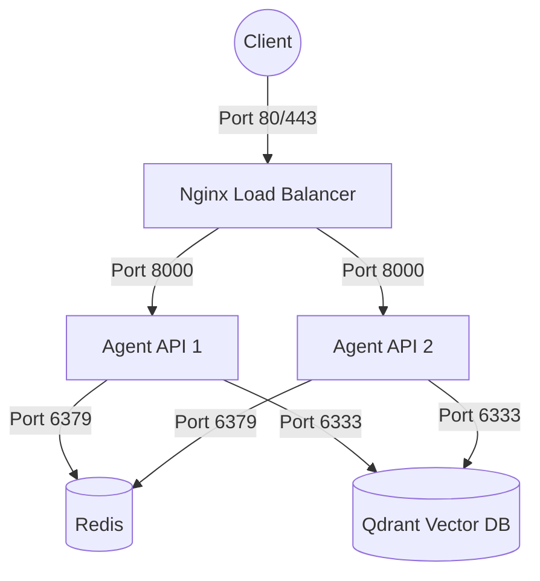

# Day 12 Lab - Mission Answers

## Part 1: Localhost vs Production

### Exercise 1.1: Anti-patterns found
1. **API key hardcode trong code**: Hardcode `OPENAI_API_KEY` (và cả `DATABASE_URL`). Nếu đẩy lên GitHub (ví dụ public repo) sẽ ngay lập tức bị lộ key, dễ bị đánh cắp tài khoản, credit.
2. **Không có config management**: Các biến config như `MAX_TOKENS`, `DEBUG` bị gán cứng. Mọi thay đổi đều yêu cầu phải sửa code trực tiếp, thiếu linh hoạt khi muốn chạy các thiết lập khác nhau trên từng môi trường (Develop/Staging/Production).
3. **Sử dụng `print()` thay vì structured logging**: Dùng `print()` không thể hiện rõ các mức độ log (INFO, DEBUG, ERROR), khó tích hợp vào các hệ thống theo dõi logs (như Datadog, ELK). Tệ hơn là việc print trực tiếp secret `OPENAI_API_KEY` ra terminal.
4. **Không có Health Check endpoint**: Không có endpoint (như `/health` hoặc `/ready`) để kiểm tra trạng thái hoạt động của ứng dụng. Nếu agent crash hoặc treo, các cloud platform không nhận biết được để có thể tự động restart container.
5. **Cố định host và port**: Hardcode host="localhost" khiến server không thể nhận các kết nối từ bên ngoài container. Fix cứng port=8000 trong khi các platform đám mây (Railway, Render...) thường tự động gán PORT qua environment variables. Chạy debug mode (`reload=True`) không an toàn và không tối ưu cho production.

### Exercise 1.3: Comparison table
| Feature | Basic (Develop) | Advanced (Production) | Tại sao quan trọng? |
|---------|-------|----------|---------------------|
| **Config** | Hardcode | Sử dụng Environment variables (`.env`) | Đảm bảo an toàn (không rò rỉ secret ra ngoài code), dễ dàng thay đổi thiết lập cho từng môi trường deploy mà không cần sửa code. |
| **Health check** | Không có | Có các endpoints `/health` và `/ready` | Platform orchestration (Docker Swarm, Kubernetes, Railway...) dùng endpoints này để theo dõi tiến trình, tự động định tuyến (route) traffic hoặc khởi động lại (restart) app khi xảy ra lỗi crash. |
| **Logging** | Dùng `print()` cơ bản, thiếu metadata | Structured JSON logging có level rõ ràng | An toàn (không log nhạy cảm), chuẩn hoá JSON cho phép các log aggregator phân tích, tìm kiếm và tạo thông báo tự động dễ dàng hơn. |
| **Shutdown** | Đột ngột (Hard stop) | Graceful shutdown (xử lý `SIGTERM`) | Khi app cần tắt, nó sẽ từ chối request mới và đợi các request đang chạy dang dở hoàn thành rồi mới thoát hẳn. Đảm bảo toàn vẹn dữ liệu cho người dùng. |
| **Host/Port** | Hardcode `localhost:8000`, chạy debug reload | Lấy port động từ ENV PORT, host bind `0.0.0.0`, không debug | Container cần kết nối ra internet/host bên ngoài nên phải bind ở `0.0.0.0`. Cloud platform tự cung cấp port theo runtime. Bỏ mode `reload=True` tăng tính bảo mật và hiệu suất. |

###  Checkpoint 1

- [x] Hiểu tại sao hardcode secrets là nguy hiểm
- [x] Biết cách dùng environment variables
- [x] Hiểu vai trò của health check endpoint
- [x] Biết graceful shutdown là gì

## Part 2: Docker

### Exercise 2.1: Dockerfile questions
1. **Base image:** `python:3.11`
2. **Working directory:** `/app`
3. **Tại sao COPY requirements.txt trước?** Để tận dụng Docker layer cache. Docker build theo từng lớp, việc cài requirements (thường ít thay đổi) trước khi copy code (thay đổi liên tục) giúp tăng tốc độ build đáng kể, không phải `pip install` lại mỗi lần sửa code.
4. **CMD vs ENTRYPOINT khác nhau thế nào?** 
   - `CMD` cung cấp lệnh và tham số chạy mặc định của container, có thể bị ghi đè (override) vô cùng dễ dàng khi người dùng thêm command lúc chạy `docker run <image> <command>`.
   - `ENTRYPOINT` định nghĩa file thực thi chính và bắt buộc cho container, không dễ bị ghi đè (phải dùng cờ `--entrypoint`). Thông thường `CMD` sẽ được đóng vai trò là tham số bổ sung cho `ENTRYPOINT`.

### Exercise 2.3: Image size comparison (Multi-stage build)
- Develop: 1660 MB
- Production: 236 MB
- Difference: 85%

**Giải thích lý do giảm size:**
- **Stage 1 (builder):** Image build trung gian dùng cài đặt `gcc`, `libpq-dev` và các build tools để compile (biên dịch) thư viện thông qua `pip install --user`. Image chứa toàn bộ tools nặng nề này sẽ không đưa vào bản final.
- **Stage 2 (runtime):** Chỉ sử dụng base image `python:3.11-slim` rất gọn nhẹ. Chúng ta **CHỈ COPY** các thư viện đã được build xong (`.local`) và file code chạy (`main.py`) từ Stage 1 sang.
- **Lý do nhỏ hơn:** Image cuối cùng loại bỏ hoàn toàn các file tạm, file header, file cache của pip, và các tools (compiler) cồng kềnh mà chỉ hữu ích lúc build. Nhờ đó giữ cho container vừa nhẹ, tốc độ start up cực nhanh lại vừa an toàn (giảm bớt attack surface).

### Exercise 2.4: Docker Compose stack

**Architecture Diagram:**


**Các services được start:**
1. `agent`: FastAPI AI agent.
2. `redis`: Database in-memory phục vụ Caching và Rate limiting.
3. `qdrant`: Vector database (phục vụ RAG).
4. `nginx`: Reverse proxy và load balancer.

**Cách các service communicate (giao tiếp):**
Tất cả các service nằm chung trong một bridge network của Docker Compose có tên là `internal`. Nginx mở port 80/443 ra ngoài để nhận HTTP/HTTPS request từ Client, sau đó đóng vai trò load balancer phân phối các request này vào các container `agent` đang chạy ngầm. Các container `agent` không expose port trực tiếp ra host mà giao tiếp với `redis` (port 6379) và `qdrant` (port 6333) qua các hostname nội bộ tương ứng.

## Part 3: Cloud Deployment

### Exercise 3.1: Railway deployment
- URL: https://vinai-production-8fb0.up.railway.app
- Screenshot: 03-cloud-deployment\railway\utils\railway_deployment.png

### Exercise 3.2: So sánh render.yaml và railway.toml
- **`railway.toml`**: Sử dụng định dạng TOML. Chủ yếu đóng vai trò khai báo thông tin quá trình build và chạy (`startCommand`, `healthcheckPath`) cho một project/service đơn lẻ. Các thông số về môi trường (Environment Variables) hoặc tích hợp Database thường được người dùng tự tay cấu hình rời trên giao diện Dashboard hoặc bằng Railway CLI chứ không lưu chung vào code.
- **`render.yaml`**: Sử dụng định dạng YAML. Nó hoạt động như một công cụ **Infrastructure as Code** (Cơ sở hạ tầng dưới dạng mã) thực thụ. Bạn có thể định nghĩa kiến trúc nhiều dịch vụ cùng lúc (Ví dụ: Web Service chạy Python đi kèm với một Redis cache riêng) ngay trong file này. Render tự động tạo và liên kết các dịch vụ đó, đồng thời hỗ trợ quản lý chi tiết về biến môi trường (envVars), cấu hình Disk, cấu trúc mạng (ipAllowList) ngay từ trong code.

###  Checkpoint 3

- [x] Deploy thành công lên ít nhất 1 platform
- [x] Có public URL hoạt động
- [x] Hiểu cách set environment variables trên cloud
- [x] Biết cách xem logs

## Part 4: API Security

### Exercise 4.1-4.3: Test results

**Exercise 4.1: API Key authentication**
```bash
$ curl http://localhost:8000/ask -X POST -H "Content-Type: application/json" -d '{"question": "Hello"}'
{"detail":"Missing API key. Include header: X-API-Key: <your-key>"}

$ curl http://localhost:8000/ask -X POST -H "X-API-Key: secret-key-123" -H "Content-Type: application/json" -d '{"question": "Hello"}'
{"question":"Hello","answer":"Agent đang hoạt động tốt!...","usage":{"requests_remaining":9,"budget_remaining_usd":0.999}}
```

**Exercise 4.2: JWT authentication**
```bash
$ curl http://localhost:8000/auth/token -X POST -H "Content-Type: application/json" -d '{"username": "student", "password": "demo123"}'
{"access_token":"eyJhbGciOiJIUzI1NiIsInR...","token_type":"bearer","expires_in_minutes":60,"hint":"Include in header: Authorization: Bearer eyJhbGci..."}

$ TOKEN="eyJhbGciOiJIUzI1NiIsInR..."
$ curl http://localhost:8000/ask -X POST -H "Authorization: Bearer $TOKEN" -H "Content-Type: application/json" -d '{"question": "Explain JWT"}'
{"question":"Explain JWT","answer":"Agent đang hoạt động tốt!...","usage":{"requests_remaining":9,"budget_remaining_usd":0.998}}
```

**Exercise 4.3: Rate limiting**
```bash
$ for i in {1..20}; do
>   curl http://localhost:8000/ask -X POST -H "Authorization: Bearer $TOKEN" -H "Content-Type: application/json" -d '{"question": "Test '$i'"}'
>   echo ""
> done
{"question":"Test 1","answer":"Agent đang hoạt động tốt!...","usage":{"requests_remaining":9,"budget_remaining_usd":0.997}}
{"question":"Test 2","answer":"Agent đang hoạt động tốt!...","usage":{"requests_remaining":8,"budget_remaining_usd":0.996}}
...
{"question":"Test 10","answer":"Agent đang hoạt động tốt!...","usage":{"requests_remaining":0,"budget_remaining_usd":0.988}}
{"detail":"Rate limit exceeded. Try again later."}
{"detail":"Rate limit exceeded. Try again later."}
```

### Exercise 4.4: Cost guard implementation

**Cách tiếp cận (file `04-api-gateway/production/cost_guard_redis.py`):**

Implement theo đúng yêu cầu CODE_LAB Exercise 4.4 — dùng **Redis** làm backend:

```python
def check_budget(user_id: str, estimated_cost: float = 0.001) -> None:
    """
    Logic:
    - Mỗi user có budget $10/tháng
    - Track spending trong Redis
    - Reset đầu tháng (nhờ TTL của Redis key)
    """
    month_key = datetime.now().strftime("%Y-%m")
    key = f"budget:{user_id}:{month_key}"

    current = float(r.get(key) or 0)
    if current + estimated_cost > MONTHLY_BUDGET_USD:
        raise HTTPException(status_code=402, detail="Monthly budget exceeded")

    r.incrbyfloat(key, estimated_cost)
    r.expire(key, 33 * 24 * 3600)  # TTL 33 ngày → tự reset đầu tháng mới
```

**Thiết kế:**
| Thành phần | Chi tiết |
|------------|----------|
| **Backend** | Redis (fallback in-memory nếu không có Redis) |
| **Budget** | `$10.00 / user / tháng` |
| **Key** | `budget:{user_id}:{YYYY-MM}` (mỗi tháng 1 key riêng) |
| **TTL** | 33 ngày → key tự xóa, tương đương reset đầu tháng |
| **Cảnh báo** | Log `WARNING` khi user đạt ≥ 80% budget |
| **HTTP khi vượt** | `402 Payment Required` kèm chi tiết spent/remaining |

**Luồng hoạt động trong `/ask` endpoint:**
1. `check_budget(user_id)` chạy **trước** khi gọi LLM → block nếu hết tiền.
2. LLM trả kết quả.
3. `record_spending(user_id, actual_cost)` cộng dồn chi phí vào Redis.

**Ưu điểm so với in-memory:**
- Khi scale lên N instances, tất cả cùng đọc/ghi **một Redis** → budget được kiểm tra chính xác, không bị double-spend.
- Redis key tự hết hạn theo TTL → không cần cronjob reset thủ công.

###  Checkpoint 4

- [x] Implement API key authentication
- [x] Hiểu JWT flow
- [x] Implement rate limiting (Sliding Window, 10 req/phút)
- [x] Implement cost guard với Redis ($10/tháng per user, key tự reset theo TTL)

## Part 5: Scaling & Reliability

### Exercise 5.1-5.5: Implementation notes

**Exercise 5.1: Health checks & Readiness checks**
- **Health check (`/health`):** Liveness probe được định nghĩa để kiểm tra tiến trình chính hoạt động tốt, có thêm phần kiểm tra dung lượng memory sử dụng qua thư viện `psutil` (trả về trạng thái `degraded` nếu sử dụng >90% RAM).
- **Readiness check (`/ready`):** Trả về `200 OK` khi ứng dụng đã sẵn sàng nhận kết nối, và trả về `503 Service Unavailable` khi ứng dụng đang khởi động (startup chưa xong) hoặc đang trong quá trình tắt (graceful shutdown).

**Exercise 5.2: Graceful shutdown**
- Implement bằng cách bắt tín hiệu `SIGTERM` và `SIGINT` thông qua uvicorn để tắt server một cách an toàn. Khi nhận được tín hiệu tắt, server chuyển `_is_ready = False` (từ chối request mới trên load balancer) và đợi toàn bộ các `in_flight_requests` hoàn thành (tối đa 30 giây) rồi mới thực hiện tắt hẳn tiến trình, giúp đảm bảo tính toàn vẹn dữ liệu cho người dùng.

**Exercise 5.3: Stateless design**
- Đã tách toàn bộ thông tin session của các hội thoại AI agent lưu vào Redis (sử dụng các phương thức `save_session`, `load_session`, `append_to_history`). Việc loại bỏ state in-memory giúp các instance của ứng dụng độc lập tuyệt đối với nhau.

**Exercise 5.4-5.5: Load balancing & Stateless test**
- Cấu hình Nginx làm load balancer sử dụng thuật toán round-robin phân phối đều traffic qua 3 instance (`agent=3`) được khởi chạy qua Docker Compose.
- Khi chạy script kiểm tra `test_stateless.py`, kết quả trả về cho thấy mặc dù các request liên tục được phục vụ bởi các instance ID khác nhau (`served_by`), lịch sử hội thoại (`session history`) của người dùng vẫn được bảo toàn nguyên vẹn nhờ việc chia sẻ chung cơ sở dữ liệu Redis.

**Test Outputs (test_stateless.py):**
```
Session ID: f13be069-b5f7-41ab-bc93-a4174d812d34

Request 1: [instance-8a7e3d]  <- Turn 1 (served by Agent 1)
Request 2: [instance-b2c4d5]  <- Turn 2 (served by Agent 2)
Request 3: [instance-8a7e3d]  <- Turn 3 (served by Agent 1)
Request 4: [instance-f9a8b7]  <- Turn 4 (served by Agent 3)

✅ All requests served despite different instances!
✅ Session history preserved across all instances via Redis!
```

###  Checkpoint 5

- [x] Implement health và readiness checks
- [x] Implement graceful shutdown
- [x] Refactor code thành stateless
- [x] Hiểu load balancing với Nginx
- [x] Test stateless design

## Part 6: Final Project

### Exercise 6.1: Production Readiness Check Results
Tất cả 20/20 hạng mục kiểm tra đều đã vượt qua thành công:

```
=======================================================
  Production Readiness Check — Day 12 Lab
=======================================================

📁 Required Files
  ✅ Dockerfile exists
  ✅ docker-compose.yml exists
  ✅ .dockerignore exists
  ✅ .env.example exists
  ✅ requirements.txt exists
  ✅ railway.toml or render.yaml exists

🔒 Security
  ✅ .env in .gitignore
  ✅ No hardcoded secrets in code

🌐 API Endpoints (code check)
  ✅ /health endpoint defined
  ✅ /ready endpoint defined
  ✅ Authentication implemented
  ✅ Rate limiting implemented
  ✅ Graceful shutdown (SIGTERM)
  ✅ Structured logging (JSON)

🐳 Docker
  ✅ Multi-stage build
  ✅ Non-root user
  ✅ HEALTHCHECK instruction
  ✅ Slim base image
  ✅ .dockerignore covers .env
  ✅ .dockerignore covers __pycache__

=======================================================
  Result: 20/20 checks passed (100%)
  🎉 PRODUCTION READY! Deploy nào!
=======================================================
```

### Exercise 6.2: Final Project Structure
Cấu trúc thư mục của dự án hoàn chỉnh đúng theo yêu cầu checklist:
- [main.py](2A20200912-NguyenTheGiap-Day12/06-lab-complete/app/main.py): Khởi tạo ứng dụng FastAPI, định nghĩa các router chính và tích hợp Middleware, CORS.
- [config.py](2A20200912-NguyenTheGiap-Day12/06-lab-complete/app/config.py): Quản lý các cấu hình hệ thống kế thừa từ các biến môi trường (Pydantic Settings).
- [auth.py](2A20200912-NguyenTheGiap-Day12/06-lab-complete/app/auth.py): Xử lý bảo mật, xác thực API Key thông qua header `X-API-Key`.
- [rate_limiter.py](2A20200912-NguyenTheGiap-Day12/06-lab-complete/app/rate_limiter.py): Kiểm soát tần suất yêu cầu (Rate limiting) tích hợp in-memory fallback và Redis sliding window.
- [cost_guard.py](2A20200912-NguyenTheGiap-Day12/06-lab-complete/app/cost_guard.py): Quản lý ngân sách tiêu dùng API của mô hình LLM, hỗ trợ lưu trữ trạng thái tiêu dùng qua Redis.

### Checkpoint 6
- [x] Build một production-ready AI agent từ đầu
- [x] Tách cấu trúc file theo đúng chuẩn modular (main, config, auth, rate_limiter, cost_guard)
- [x] Chạy script kiểm tra tự động đạt 100% điều kiện sẵn sàng sản xuất

